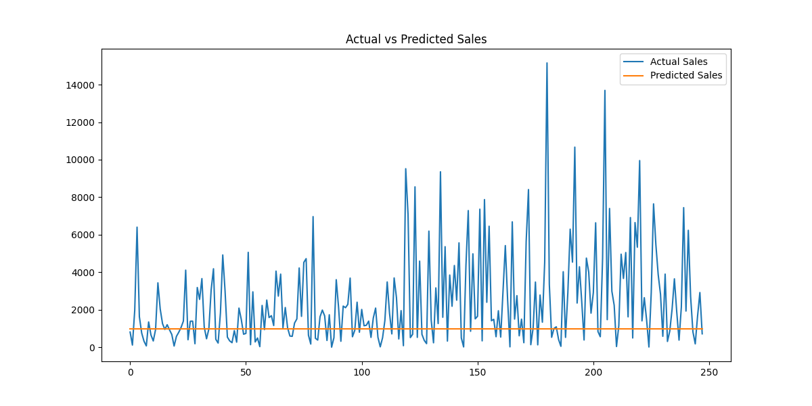
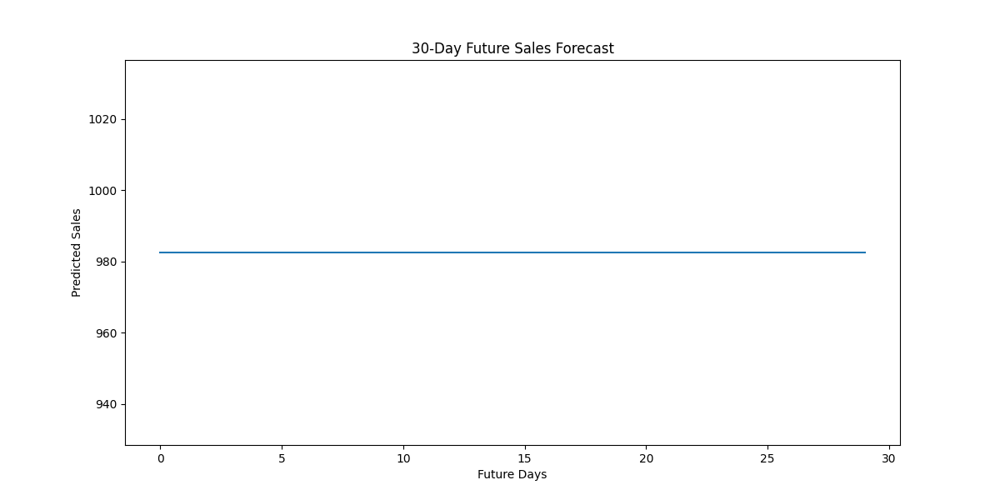
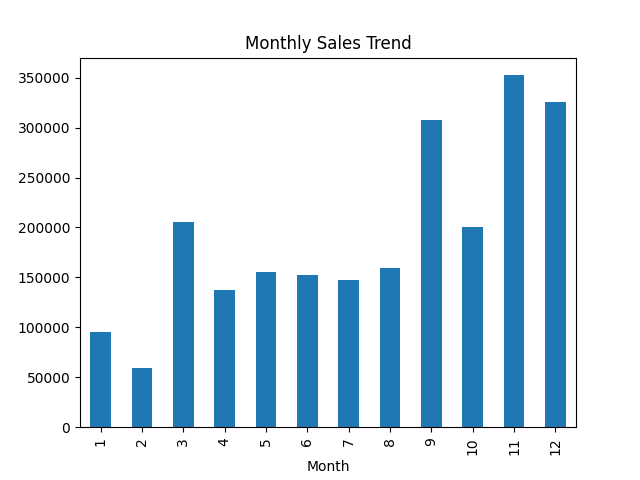

# Sales Forecasting Using Machine Learning

## Project Overview
This project focuses on predicting future retail sales using Machine Learning techniques and historical business data.

Sales forecasting is one of the most important real-world applications of Machine Learning because businesses use forecasts to:
- manage inventory
- plan staffing
- estimate future demand
- improve cash flow planning
- reduce losses caused by overstocking or understocking

This project builds a retail sales forecasting system using historical sales data and a Machine Learning regression model.

---

# Objective

The main objective of this project is to predict future sales trends based on past business data and visualize forecasts in a business-friendly way.

The project demonstrates:
- data cleaning
- feature engineering
- time-series trend analysis
- forecasting using Machine Learning
- model evaluation
- visualization of predictions

---

# Dataset Used

Dataset: Superstore Sales Dataset

The dataset contains:
- Order Dates
- Product Information
- Sales
- Profit
- Region
- Customer Details

Dataset Source:
https://www.kaggle.com/datasets/vivek468/superstore-dataset-final

---

# Technologies Used

- Python
- Pandas
- NumPy
- Matplotlib
- Scikit-learn
- VS Code

---

# Machine Learning Model

Model Used:
- Random Forest Regressor

The model was trained on historical sales trends to forecast future sales.

---

# Features Implemented

## Data Cleaning
- handled missing values
- converted date columns into datetime format

## Feature Engineering
Created time-based features such as:
- Year
- Month
- Day
- Weekday
- Trend index (Days)

## Forecasting
Built a sales forecasting model using Random Forest Regression.

## Model Evaluation
Evaluated model performance using:
- MAE (Mean Absolute Error)
- RMSE (Root Mean Squared Error)

## Visualization
Generated business-friendly visualizations:
- Actual vs Predicted Sales
- 30-Day Future Sales Forecast

---

# Project Structure

# Project Structure

```text
FUTURE_ML_01/
│
├── data/
│   └── sales.csv
│
├── images/
│   ├── forecast.png
│   └── future_forecast.png
│
├── main.py
├── README.md
└── requirements.txt
```
---

# Installation

## Clone Repository

```bash
git clone https://github.com/hasinichandana/FUTURE_ML_01.git
```

## Install Required Libraries

```bash
pip install pandas numpy matplotlib scikit-learn
```

---

# Run Project

```bash
python main.py
```
# Output

The project generates:

Sales forecasting results,
Evaluation metrics,
Forecast visualizations

---

# Project Visualizations

## Actual vs Predicted Sales



## 30-Day Future Forecast



## Monthly Sales Trend



Generated Images:

forecast.png,
future_forecast.png,
graph_name.png

Model Evaluation Results 

MAE (Mean Absolute Error)

MAE measures the average difference between predicted sales and actual sales.

# Formula:

MAE = (1/n) * Σ |Actual - Predicted|

Project Result:

MAE: 1821.327

RMSE (Root Mean Squared Error)

RMSE penalizes larger forecasting errors more heavily.

RMSE = √ [(1/n) * Σ (Actual - Predicted)²]

Project Result:

RMSE: 2861.3716

# Business Insights

The forecasting system helps businesses:

predict future demand,
optimize inventory management,
improve operational planning,
reduce unnecessary stock costs,
prepare staffing requirements during high-demand periods,

The model successfully identifies overall sales trends and can support business decision-making.

# Future Improvements

Possible future enhancements:

Use advanced forecasting models like ARIMA or Prophet,
Add seasonal trend analysis,
Deploy as a web application,
Build an interactive dashboard using Power BI or Tableau,

# Conclusion

This project demonstrates how Machine Learning can be applied to solve real business forecasting problems.

Using historical retail sales data, the system predicts future sales trends and provides business-friendly insights that can support planning and operational decisions.

# Author
Gadamsetty Venkata Sai Hasini Chandana

Developed as part of the Future Interns Machine Learning Task.
